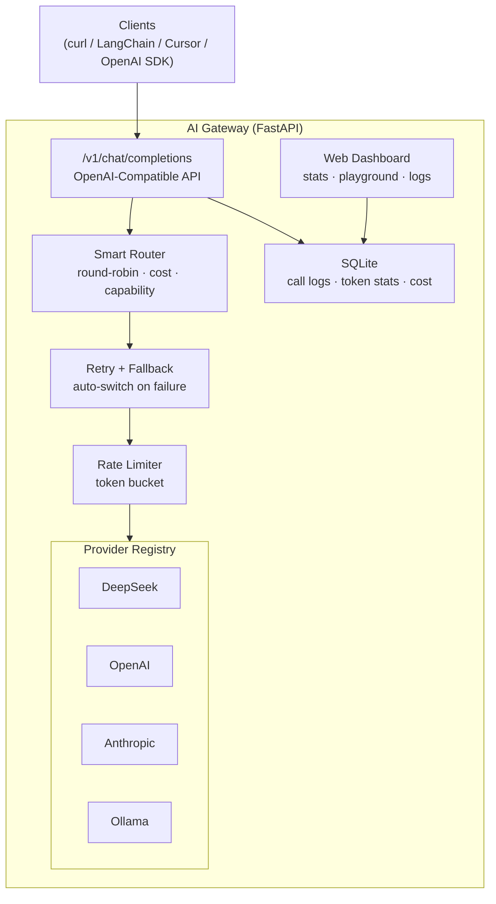

# AI Gateway

Lightweight Multi-Model AI Inference Gateway

[中文文档](README_CN.md)

## Architecture



## Features

- **Unified API** — OpenAI-compatible `/v1/chat/completions`, works with any OpenAI SDK client
- **Multi-Provider** — DeepSeek, OpenAI, Anthropic (Claude), Ollama (local models)
- **Real SSE Streaming** — Token-by-token streaming, not buffered
- **Smart Routing** — Round-robin, cost-optimized, capability-based strategies
- **Auto Fallback** — Transparent switch to backup when primary model fails
- **Rate Limiting** — Token bucket algorithm, per-provider throttling
- **Cost Tracking** — Per-model pricing, per-call cost calculation
- **Call Logging** — SQLite-backed logs with token usage and latency
- **Web Dashboard** — Stats, cost charts, provider status, playground, call logs

## Quick Start

```bash
git clone https://github.com/DNMCJH/ai-gateway.git
cd ai-gateway

python -m venv venv
# Linux/Mac:
source venv/bin/activate
# Windows:
.\venv\Scripts\activate

pip install -r requirements.txt

cp .env.example .env
# Edit .env with your API keys

# Start
python -m uvicorn app.main:app --host 0.0.0.0 --port 9001
```

Open `http://localhost:9001/dashboard` for the web UI.

## Docker

```bash
cp .env.example .env  # edit with your keys
docker-compose up -d
```

## Remote Deployment (Cloudflare Tunnel)

For servers without a public IP, use Cloudflare Tunnel to expose the service:

```bash
# Start the service
python -m uvicorn app.main:app --host 0.0.0.0 --port 9001

# In another terminal, start the tunnel
cloudflared tunnel --url http://localhost:9001
```

Access the dashboard at `https://xxx.trycloudflare.com/dashboard`.

## API Usage

### Chat Completion

```bash
curl http://localhost:9001/v1/chat/completions \
  -H "Content-Type: application/json" \
  -d '{
    "model": "deepseek-chat",
    "messages": [{"role": "user", "content": "Hello!"}]
  }'
```

### Streaming

```bash
curl http://localhost:9001/v1/chat/completions \
  -H "Content-Type: application/json" \
  -d '{
    "model": "deepseek-chat",
    "messages": [{"role": "user", "content": "Hello!"}],
    "stream": true
  }'
```

### Smart Routing

```bash
# Use "auto" to let the gateway pick the best model
curl http://localhost:9001/v1/chat/completions \
  -H "Content-Type: application/json" \
  -d '{
    "model": "auto",
    "messages": [{"role": "user", "content": "Write a Python function"}]
  }'
```

### Admin API

```bash
curl http://localhost:9001/v1/models                 # List models
curl http://localhost:9001/api/admin/stats            # Aggregated statistics
curl http://localhost:9001/api/admin/logs             # Call logs
curl http://localhost:9001/api/admin/providers        # Provider status
curl http://localhost:9001/api/admin/config/routing   # Routing strategy
```

## Supported Models

| Provider | Models | Pricing (per 1M tokens) |
|----------|--------|------------------------|
| DeepSeek | deepseek-chat, deepseek-reasoner | $0.14 - $2.19 |
| OpenAI | gpt-4o, gpt-4o-mini, gpt-3.5-turbo | $0.15 - $10.00 |
| Anthropic | claude-sonnet-4, claude-3.5-haiku | $0.80 - $15.00 |
| Ollama | (auto-discovered local models) | Free |

## Design Decisions

1. **Provider Abstraction with AsyncIterator** — Streaming uses `AsyncIterator` which composes naturally with FastAPI's `EventSourceResponse`, keeping backpressure handling simple.

2. **Stateless Gateway** — No conversation state stored. The gateway forwards messages as-is. This keeps it horizontally scalable and follows the same pattern as OpenAI's API.

3. **First-Chunk Timeout for Fallback** — In streaming mode, we can't switch providers mid-stream. Instead, we set a timeout for the first chunk — if the primary doesn't respond in time, we switch to fallback before any data reaches the client.

4. **Strategy Pattern for Routing** — Routing strategies are pluggable. Adding a new strategy is one class. The router doesn't know about specific strategies.

5. **OpenAI-Compatible API Surface** — Any tool that works with OpenAI (LangChain, Cursor, etc.) works with this gateway out of the box.

## Tech Stack

- **Backend**: Python, FastAPI, httpx, aiosqlite, sse-starlette
- **Frontend**: HTML, Tailwind CSS, Alpine.js, Chart.js
- **Database**: SQLite
- **Deployment**: Docker, docker-compose, Cloudflare Tunnel

## License

MIT
