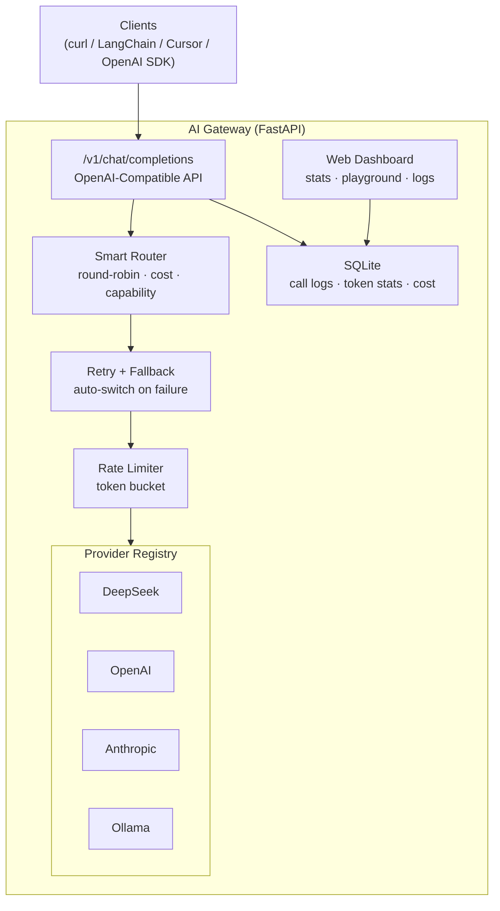

# AI Gateway

轻量级多模型 AI 推理网关 | Lightweight Multi-Model AI Inference Gateway

## Architecture



## Features / 功能

- **统一 API** — 兼容 OpenAI 格式 `/v1/chat/completions`，任何 OpenAI SDK 客户端可直接对接
- **多模型接入** — DeepSeek、OpenAI、Anthropic (Claude)、Ollama (本地模型)
- **真实 SSE 流式** — 逐 token 流式输出，非缓冲
- **智能路由** — 支持 round-robin / 成本优先 / 能力匹配三种策略
- **自动降级** — 主模型故障时透明切换备选模型
- **速率限制** — 令牌桶算法，按 Provider 限流
- **成本追踪** — 按模型实际定价计算每次调用成本
- **调用日志** — SQLite 记录每次调用的 token 用量和延迟
- **Web 管理面板** — 统计图表、Playground 对话测试、调用日志查看

## Quick Start / 快速开始

```bash
git clone https://github.com/DNMCJH/ai-gateway.git
cd ai-gateway

python -m venv venv
# Linux/Mac:
source venv/bin/activate
# Windows:
.\venv\Scripts\activate

pip install -r requirements.txt

cp .env.example .env
# 编辑 .env 填入你的 API Key

# 启动
python -m uvicorn app.main:app --host 0.0.0.0 --port 9001
```

打开 `http://localhost:9001/dashboard` 进入管理面板。

## Docker 部署

```bash
cp .env.example .env  # 编辑填入 API Key
docker-compose up -d
```

## 远程部署 (Cloudflare Tunnel)

如果服务器没有公网 IP，可以用 Cloudflare Tunnel 暴露服务：

```bash
# 启动服务
python -m uvicorn app.main:app --host 0.0.0.0 --port 9001

# 另开终端，启动 tunnel
cloudflared tunnel --url http://localhost:9001
```

访问 tunnel 输出的 `https://xxx.trycloudflare.com/dashboard` 即可。

## API 使用

### 对话补全

```bash
curl http://localhost:9001/v1/chat/completions \
  -H "Content-Type: application/json" \
  -d '{
    "model": "deepseek-chat",
    "messages": [{"role": "user", "content": "Hello!"}]
  }'
```

### 流式输出

```bash
curl http://localhost:9001/v1/chat/completions \
  -H "Content-Type: application/json" \
  -d '{
    "model": "deepseek-chat",
    "messages": [{"role": "user", "content": "Hello!"}],
    "stream": true
  }'
```

### 智能路由

```bash
# 使用 "auto" 让网关自动选择最优模型
curl http://localhost:9001/v1/chat/completions \
  -H "Content-Type: application/json" \
  -d '{
    "model": "auto",
    "messages": [{"role": "user", "content": "Write a Python function"}]
  }'
```

### 管理接口

```bash
curl http://localhost:9001/v1/models              # 模型列表
curl http://localhost:9001/api/admin/stats         # 聚合统计
curl http://localhost:9001/api/admin/logs          # 调用日志
curl http://localhost:9001/api/admin/providers     # Provider 状态
curl http://localhost:9001/api/admin/config/routing  # 路由策略
```

## 支持的模型

| Provider | Models | 定价 (每 1M tokens) |
|----------|--------|-------------------|
| DeepSeek | deepseek-chat, deepseek-reasoner | $0.14 - $2.19 |
| OpenAI | gpt-4o, gpt-4o-mini, gpt-3.5-turbo | $0.15 - $10.00 |
| Anthropic | claude-sonnet-4, claude-3.5-haiku | $0.80 - $15.00 |
| Ollama | (自动发现本地模型) | 免费 |

## 设计决策 / Design Decisions

1. **Provider 抽象 + AsyncIterator** — 流式接口使用 `AsyncIterator`，与 FastAPI 的 `EventSourceResponse` 天然组合，背压处理简洁。

2. **无状态网关** — 不存储对话历史，网关只做转发。水平扩展友好，与 OpenAI API 设计一致。

3. **首 Chunk 超时降级** — 流式场景无法中途切换 Provider。通过设置首 chunk 超时，在数据到达客户端前完成 fallback 切换。

4. **Strategy 模式路由** — 路由策略可插拔，新增策略只需实现一个类，路由器不感知具体策略。

5. **OpenAI 兼容 API** — 任何支持 OpenAI 的工具（LangChain、Cursor 等）可直接对接，零改造。

## 技术栈

- **后端**: Python, FastAPI, httpx, aiosqlite, sse-starlette
- **前端**: HTML, Tailwind CSS, Alpine.js, Chart.js
- **数据库**: SQLite
- **部署**: Docker, docker-compose, Cloudflare Tunnel

## License

MIT
