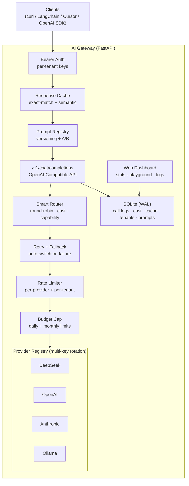

# AI Gateway

Production-Grade Multi-Model LLM Inference Gateway

[中文文档](README_CN.md)

## Architecture


```mermaid
graph TB
    Client["Clients<br/>(curl / LangChain / Cursor / OpenAI SDK)"]
    
    subgraph Gateway["AI Gateway (FastAPI)"]
        Auth["Bearer Auth<br/>per-tenant keys"]
        Cache["Response Cache<br/>exact-match + semantic"]
        Prompt["Prompt Registry<br/>versioning + A/B"]
        API["/v1/chat/completions<br/>OpenAI-Compatible API"]
        Router["Smart Router<br/>round-robin · cost · capability"]
        Retry["Retry + Fallback<br/>auto-switch on failure"]
        Limiter["Rate Limiter<br/>per-provider + per-tenant"]
        Budget["Budget Cap<br/>daily + monthly limits"]
        
        subgraph Providers["Provider Registry (multi-key rotation)"]
            DS[DeepSeek]
            OAI[OpenAI]
            Claude[Anthropic]
            Ollama[Ollama]
        end
        
        DB["SQLite (WAL)<br/>call logs · cost · cache · tenants · prompts"]
        Dashboard["Web Dashboard<br/>stats · playground · logs"]
    end
    
    Client --> Auth
    Auth --> Cache
    Cache --> Prompt
    Prompt --> API
    API --> Router
    Router --> Retry
    Retry --> Limiter
    Limiter --> Budget
    Budget --> Providers
    API --> DB
    Dashboard --> DB
```

## Features

### Core
- **Unified API** — OpenAI-compatible `/v1/chat/completions`, works with any OpenAI SDK client
- **Multi-Provider** — DeepSeek, OpenAI, Anthropic (Claude), Ollama (local models)
- **Real SSE Streaming** — Token-by-token streaming with accurate usage tracking
- **Smart Routing** — Round-robin, cost-optimized, capability-based strategies
- **Auto Fallback** — Transparent switch to backup when primary model fails
- **Model Aliases** — `auto`, `best`, `cheapest` resolve to concrete provider+model

### Performance & Reliability
- **Response Cache** — Exact-match (SHA256) with configurable TTL, zero-cost cache hits
- **Semantic Cache** — Optional embedding-based similarity matching (DeepSeek embeddings, threshold 0.92)
- **Key Rotation** — CSV multi-key per provider, round-robin with auto-cooldown on 401/403/429
- **WAL Database** — Single-writer task with asyncio queue, concurrent reads via WAL mode
- **Graceful Shutdown** — httpx clients closed, DB queue drained on exit

### Multi-Tenant & Cost Control
- **Bearer Auth** — Gateway API key protection, disabled in dev mode (empty key list)
- **Per-Tenant Rate Limiting** — Independent RPM limits per gateway key
- **Budget Caps** — Daily and monthly spend limits, auto-reject on overspend
- **Cost Tracking** — Per-model pricing, per-call cost calculation, spend dashboards

### Prompt Management
- **Prompt Registry** — Named prompt templates with version history
- **A/B Testing** — Weighted random split across prompt versions
- **Prompt References** — Pass `prompt_id` in requests instead of raw messages

### Observability
- **Call Logging** — Request/response body logging (opt-in, truncated)
- **Web Dashboard** — Stats, cost charts, provider status, playground, call logs
- **Admin API** — Full CRUD for tenants, prompts, cache stats, routing config

## Quick Start

```bash
git clone https://github.com/DNMCJH/ai-gateway.git
cd ai-gateway
cp .env.example .env
# Edit .env with your API keys
docker compose up -d --build
```

Open `http://localhost:8000/dashboard` for the web UI.

### Without Docker

```bash
python -m venv venv && source venv/bin/activate  # Windows: .\venv\Scripts\activate
pip install -r requirements.txt
cp .env.example .env  # edit with your keys
python -m uvicorn app.main:app --host 0.0.0.0 --port 9001
```

## Configuration

Key `.env` variables:

```env
# Provider keys (CSV for multi-key rotation)
DEEPSEEK_API_KEY=sk-key1,sk-key2,sk-key3
OPENAI_API_KEY=sk-xxx
ANTHROPIC_API_KEY=sk-ant-xxx

# Gateway auth (CSV, empty = disabled)
GATEWAY_API_KEYS_RAW=your-secret-key-1,your-secret-key-2

# Routing
DEFAULT_ROUTING_STRATEGY=round-robin  # round-robin | cost | capability
RATE_LIMIT_RPM=60

# Cache
CACHE_ENABLED=true
CACHE_TTL_SECONDS=3600
SEMANTIC_CACHE_ENABLED=false
SEMANTIC_CACHE_THRESHOLD=0.92

# Logging (off by default — bodies may contain PII)
LOG_REQUEST_BODY=false
LOG_RESPONSE_BODY=false
```

## API Usage

All endpoints require `Authorization: Bearer <gateway-key>` when `GATEWAY_API_KEYS_RAW` is set.

### Chat Completion

```bash
curl http://localhost:9001/v1/chat/completions \
  -H "Authorization: Bearer your-key" \
  -H "Content-Type: application/json" \
  -d '{
    "model": "deepseek-chat",
    "messages": [{"role": "user", "content": "Hello!"}]
  }'
```

### Smart Routing (model aliases)

```bash
# "auto" = default strategy, "best" = capability, "cheapest" = cost
curl http://localhost:9001/v1/chat/completions \
  -H "Authorization: Bearer your-key" \
  -H "Content-Type: application/json" \
  -d '{"model": "auto", "messages": [{"role": "user", "content": "Write a sort function"}]}'
```

### Using Prompt Registry

```bash
# Register a prompt
curl -X POST http://localhost:9001/api/admin/prompts \
  -H "Authorization: Bearer your-key" \
  -H "Content-Type: application/json" \
  -d '{
    "name": "code-review",
    "messages": [{"role": "system", "content": "You are a senior code reviewer. Be concise."}],
    "model": "deepseek-chat",
    "temperature": 0.3
  }'

# Use it in a request (prompt messages prepended to your messages)
curl http://localhost:9001/v1/chat/completions \
  -H "Authorization: Bearer your-key" \
  -H "Content-Type: application/json" \
  -d '{
    "model": "deepseek-chat",
    "prompt_id": "code-review",
    "messages": [{"role": "user", "content": "Review this: def f(x): return x+1"}]
  }'
```

### Admin API

```bash
# Models & providers
curl -H "Authorization: Bearer $KEY" http://localhost:9001/v1/models
curl -H "Authorization: Bearer $KEY" http://localhost:9001/api/admin/providers

# Stats & logs
curl -H "Authorization: Bearer $KEY" http://localhost:9001/api/admin/stats
curl -H "Authorization: Bearer $KEY" http://localhost:9001/api/admin/logs?limit=50

# Cache
curl -H "Authorization: Bearer $KEY" http://localhost:9001/api/admin/cache/stats

# Tenants
curl -H "Authorization: Bearer $KEY" http://localhost:9001/api/admin/tenants
curl -X POST -H "Authorization: Bearer $KEY" -H "Content-Type: application/json" \
  http://localhost:9001/api/admin/tenants \
  -d '{"api_key": "tenant-key-1", "name": "dev-team", "rpm_limit": 30, "daily_budget_usd": 5.0}'

# Prompts
curl -H "Authorization: Bearer $KEY" http://localhost:9001/api/admin/prompts
curl -H "Authorization: Bearer $KEY" http://localhost:9001/api/admin/prompts/code-review/resolve

# Routing strategy
curl -X POST -H "Authorization: Bearer $KEY" "http://localhost:9001/api/admin/config/routing?strategy=cost"
```

## Supported Models

| Provider | Models | Pricing (per 1M tokens) |
|----------|--------|------------------------|
| DeepSeek | deepseek-chat, deepseek-reasoner | $0.14 - $2.19 |
| OpenAI | gpt-4o, gpt-4o-mini, gpt-3.5-turbo | $0.15 - $10.00 |
| Anthropic | claude-sonnet-4, claude-3.5-haiku | $0.80 - $15.00 |
| Ollama | (auto-discovered local models) | Free |

## Design Decisions

1. **Response Cache Before Routing** — Cache check happens after auth but before provider selection. Cache hits cost nothing and skip rate limiting entirely.

2. **Per-Tenant Isolation** — Each gateway key can be registered as a tenant with independent RPM and budget. Unregistered keys still work (using global limits) for backward compatibility.

3. **Prompt Registry with A/B** — Multiple active versions of the same prompt name get weighted random selection. This enables gradual prompt iteration without code changes.

4. **Semantic Cache as Opt-In** — Embedding-based cache adds API call cost per miss. Disabled by default; enable when repeated similar (not identical) queries are common.

5. **Single-Writer DB Pattern** — All writes go through one asyncio task via a queue. Eliminates SQLite write contention under concurrent load. Reads use separate connections with WAL.

6. **Key Pool with Auto-Cooldown** — Provider keys rotate round-robin. On 401/403/429, the failing key is disabled for 60s. Requests continue on remaining keys without user-visible errors.

## Tech Stack

- **Backend**: Python, FastAPI, httpx, aiosqlite, sse-starlette
- **Frontend**: HTML, Tailwind CSS, Alpine.js, Chart.js
- **Database**: SQLite (WAL mode)
- **Deployment**: Docker, docker-compose

## License

MIT
