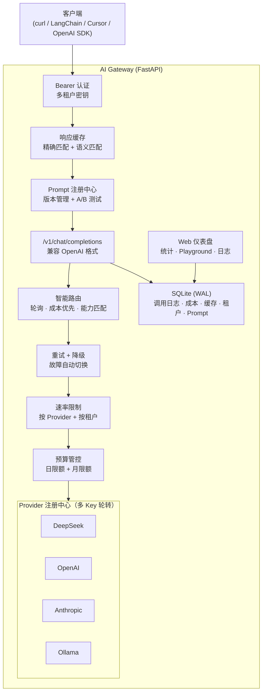

# AI Gateway

生产级多模型 LLM 推理网关

[English](README.md)

## 架构



## 功能特性

### 核心能力
- **统一 API** — 兼容 OpenAI 的 `/v1/chat/completions`，任何 OpenAI SDK 客户端直接对接
- **多 Provider** — DeepSeek、OpenAI、Anthropic (Claude)、Ollama (本地模型)
- **真实 SSE 流式** — 逐 token 流式输出，带准确的 usage 统计
- **智能路由** — 轮询、成本优先、能力匹配三种策略
- **自动降级** — 主模型失败时透明切换到备用 Provider
- **模型别名** — `auto`、`best`、`cheapest` 自动解析为具体 Provider+模型

### 性能与可靠性
- **响应缓存** — SHA256 精确匹配，可配置 TTL，命中时零延迟零成本
- **语义缓存** — 可选的 embedding 相似度匹配（DeepSeek embeddings，阈值 0.92）
- **Key 轮转** — 每个 Provider 支持 CSV 多 Key，轮询 + 401/403/429 自动熔断 60 秒
- **WAL 数据库** — 单 writer 任务 + asyncio 队列，WAL 模式支持并发读
- **优雅关闭** — 退出时关闭所有 httpx 连接，排空 DB 写入队列

### 多租户与成本管控
- **Bearer 认证** — Gateway API Key 保护，开发模式可关闭
- **租户级限流** — 每个 Gateway Key 独立 RPM 限制
- **预算上限** — 日/月消费上限，超限自动拒绝请求
- **成本追踪** — 按模型计价，按调用计费，消费看板

### Prompt 管理
- **Prompt 注册中心** — 命名 Prompt 模板，带版本历史
- **A/B 测试** — 多版本加权随机分流
- **Prompt 引用** — 请求中传 `prompt_id` 替代原始 messages

### 可观测性
- **调用日志** — 请求/响应体记录（可选开启，自动截断）
- **Web 仪表盘** — 统计、成本图表、Provider 状态、Playground、调用日志
- **Admin API** — 租户、Prompt、缓存、路由策略的完整 CRUD

## 快速开始

```bash
git clone https://github.com/DNMCJH/ai-gateway.git
cd ai-gateway
cp .env.example .env
# 编辑 .env 填入你的 API Key
docker compose up -d --build
```

打开 `http://localhost:8000/dashboard` 查看仪表盘。

### 不用 Docker

```bash
python -m venv venv && source venv/bin/activate  # Windows: .\venv\Scripts\activate
pip install -r requirements.txt
cp .env.example .env  # 编辑填入 Key
python -m uvicorn app.main:app --host 0.0.0.0 --port 9001
```

## 配置说明

`.env` 关键配置项：

```env
# Provider Key（逗号分隔支持多 Key 轮转）
DEEPSEEK_API_KEY=sk-key1,sk-key2,sk-key3
OPENAI_API_KEY=sk-xxx
ANTHROPIC_API_KEY=sk-ant-xxx

# 网关认证（逗号分隔，留空=关闭认证）
GATEWAY_API_KEYS_RAW=your-secret-key-1,your-secret-key-2

# 路由策略
DEFAULT_ROUTING_STRATEGY=round-robin  # round-robin | cost | capability
RATE_LIMIT_RPM=60

# 缓存
CACHE_ENABLED=true
CACHE_TTL_SECONDS=3600
SEMANTIC_CACHE_ENABLED=false
SEMANTIC_CACHE_THRESHOLD=0.92

# 日志（默认关闭——请求体可能含敏感信息）
LOG_REQUEST_BODY=false
LOG_RESPONSE_BODY=false
```

## 技术栈

- **后端**: Python, FastAPI, httpx, aiosqlite, sse-starlette
- **前端**: HTML, Tailwind CSS, Alpine.js, Chart.js
- **数据库**: SQLite (WAL 模式)
- **部署**: Docker, docker-compose

## License

MIT
